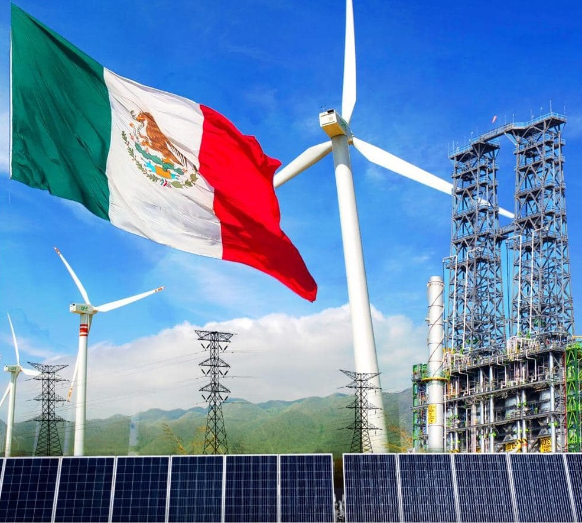

# Analysis of the opportunities for renewable energy in Mexico

  

Nowadays, the overexploting of the non renewables resources are leading Mexico to take energetic alternatives for the lack of fosil fuels and global climate consecuenses.

Mexico is a country with great potential in geothermal energy, solar, eolic and hydraulic energy, but only 22% of national eletricity comes from renewable resources.
That´s why it has been made an analysis of every Mexico state comparing its energetic and economic potential, the fuel consumption and a comparation with other countries to create alternatives in the energetic field through graphs and machine learning models.

### Data cleaning
Dirty databases were used, so the cleaning must be done before any analysis or data manipulation. Mostly, these functions were used in every document but also every csv file was mannaged individually according to its requirement or particular needs.  
      def limpiar_indices(*args): 
        for i in range (len(df_dirty.columns)):
          df_dirty.columns.values[i] = (df_dirty.columns[i]).lower().replace(' ','_')
      
      def limpiar_strings(*nombres_col):
        for col in nombres_col:
          df_dirty[col] = df_dirty[col].str.lower()
      
      def limpiar_numeros_comas(*nombres_col):
        for col in nombres_col:
          df_dirty[col] = df_dirty[col].str.replace(',', '', regex=False)
          df_dirty[col] = pd.to_numeric(df_dirty[col], errors= 'coerce')
      
      def limpiar_numeros(*nombres_col):
        for col in nombres_col:
          df_dirty[col] = pd.to_numeric(df_dirty[col], errors= 'coerce')
      
      def llenar_vacios(*nombres_col):
        for col in nombres_col:
          df_dirty[col] = df_dirty[col].fillna(df_dirty[col].median()) 

The largest database used was the global energetic containing categories such as capacity, power sector emitions... for every type of energy (eolic, solar, fossil, clean, bioenergy, etc. It has 357014 rows × 18 columns so it was a challenge to apply the correct filters according to the results and the conclutions that are wanted.
